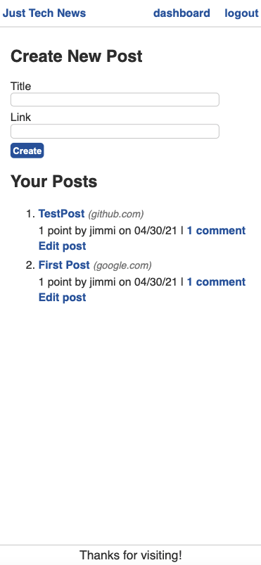
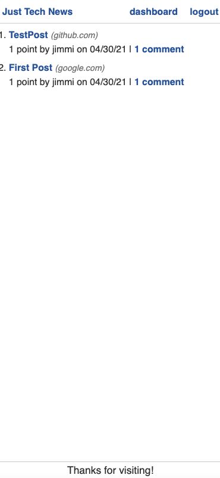

# Just Tech News Python App

## Description

Stay in the loop with all of the latest tech field news on the web!

## Table of Contents

- [Installation](#installation)
- [Usage](#usage)
- [Technologies](#technologies)
- [Deployed URL](#deployed-url)
- [License](#license)

## Installation

Navigate the deployed Heroku URL to begin.

## Usage

- Sign up for an account, or log in.

Then:

- Dashboard (default page on login):
  - `Create` a post with a `Title` and `Link` to a journal or article's external URL | **NOTE** URL must include full span (http:// or https:// etc...) -- it's best to copy and paste from your searchbar
  - `Delete post` or `Save post` with new changes by clicking `Edit post`
- Posts feed accessed via `Just Tech News` button in the navbar
  - From here: click on a post's title to follow the attached link, comment by clicking the `X comment(s)` button, or show some love and validation with `upvote`

## Technologies

- `Python`
- `MySQL`
- `SQLAlchemy`
- `Flask`
- `Bcrypt`
- `Dot-env`

## Deployed URL

[https://just-tech-news-feed.herokuapp.com/](https://just-tech-news-feed.herokuapp.com/)

## Questions

If you have any questions, please contact jimbopulos at james.mgalantino@gmail.com

## License

MIT License

Copyright (c) 2021 James Galantino

Permission is hereby granted, free of charge, to any person obtaining a copy
of this software and associated documentation files (the "Software"), to deal
in the Software without restriction, including without limitation the rights
to use, copy, modify, merge, publish, distribute, sublicense, and/or sell
copies of the Software, and to permit persons to whom the Software is
furnished to do so, subject to the following conditions:

The above copyright notice and this permission notice shall be included in all
copies or substantial portions of the Software.

THE SOFTWARE IS PROVIDED "AS IS", WITHOUT WARRANTY OF ANY KIND, EXPRESS OR
IMPLIED, INCLUDING BUT NOT LIMITED TO THE WARRANTIES OF MERCHANTABILITY,
FITNESS FOR A PARTICULAR PURPOSE AND NONINFRINGEMENT. IN NO EVENT SHALL THE
AUTHORS OR COPYRIGHT HOLDERS BE LIABLE FOR ANY CLAIM, DAMAGES OR OTHER
LIABILITY, WHETHER IN AN ACTION OF CONTRACT, TORT OR OTHERWISE, ARISING FROM,
OUT OF OR IN CONNECTION WITH THE SOFTWARE OR THE USE OR OTHER DEALINGS IN THE
SOFTWARE.
